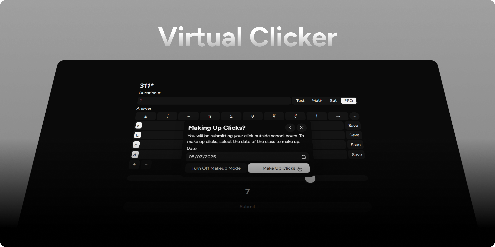

# Virtual Clicker

Next generation clicking: fixed, upgraded, and cloud hosted ☁️🚀

- LaTeX Math, Multiple Choice, Set Inputs
- Predictive Typing, Keyboard Shortcuts
- WYSIWYG Numerical & Written Answers
- Many Themes, Custom Theme Builder
- Response & Make-up History
- Cache & Cookie Busting
- Class Make-up Modes
- Many More Features

## Development

`npm install`
`npm run dev`

Vite will start a development server at `localhost:5173`

### Credits

- [khui0](https://github.com/khui0) - Commits before 5/21/2024

## Build

`npm run build`

Serve the files that are generated in `/dist`

## Beta

A beta version of this project is hosted on [Dango Web Solutions](https://dangoweb.com/?from=virtual-clicker) cloud hosting - free web hosting for Education. The beta version is updated with the latest changes from the [`beta`](https://github.com/faisalnjs/Virtual-Clicker/tree/beta) branch. The beta version is used for testing new features and bug fixes before they are deployed to production. The beta version is not guaranteed to be stable and may contain bugs or unfinished features.

Files are transferred to the host using the GitHub Action automation workflow at [.github\workflows\deploy-beta.yml](https://github.com/faisalnjs/Virtual-Clicker/tree/main/.github/workflows/deploy-beta.yml).

## Production

This project is hosted on [Dango Web Solutions](https://dangoweb.com/?from=virtual-clicker) cloud hosting - free web hosting for Education.

Files are transferred to the host using the GitHub Action automation workflow at [.github\workflows\deploy.yml](https://github.com/faisalnjs/Virtual-Clicker/tree/main/.github/workflows/deploy.yml).

